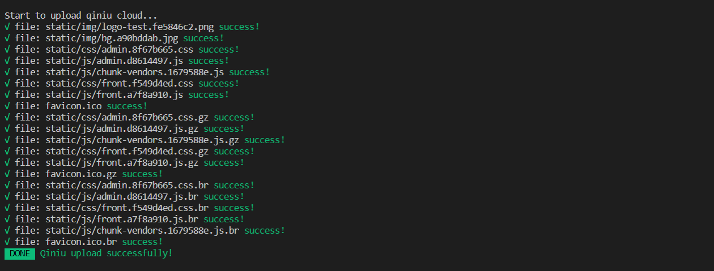

# qiniu-upload-webpack-plugin

> 将 webpack 打包出来的 assets 上传到七牛云。

# 特点

+ 上传webpack打包后的所有静态资源到七牛云
+ 自动忽略.html, .html.br, .html.gz文件
+ 支持覆盖已上传文件

基于官方七牛云[Node.js SDK](https://developer.qiniu.com/kodo/sdk/1289/nodejs)。


# 安装
> npm install qiniu-upload-webpack-plugin

# 使用方法

```
const QiniuUploadWebpackPlugin = require('qiniu-upload-webpack-plugin')
plugins: [
  new QiniuUploadWebpackPlugin({
    publicPath: 'http://xxx.com', // 七牛云域名，自动替换 publicPath
    accessKey: 'accessKey', // 个人中心，秘钥管理，AK
    secretKey: 'secretKey', // 个人中心，秘钥管理，SK
    bucket: 'xxx', // 存储空间名称
    zone: 'Zone_z0' // 空间对应的机房，zone_z1代表华北，其他配置参见七牛云文档
  })
];

```

# 效果截图

